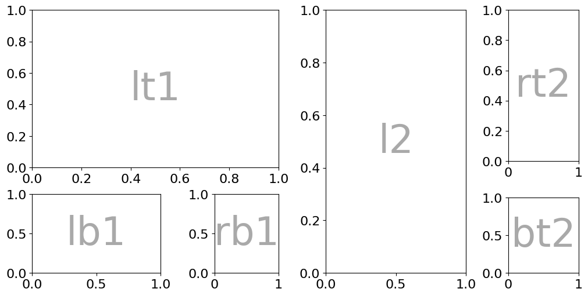
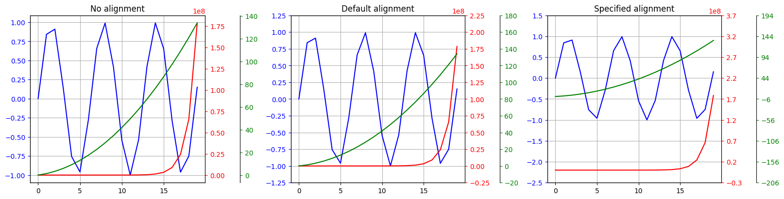
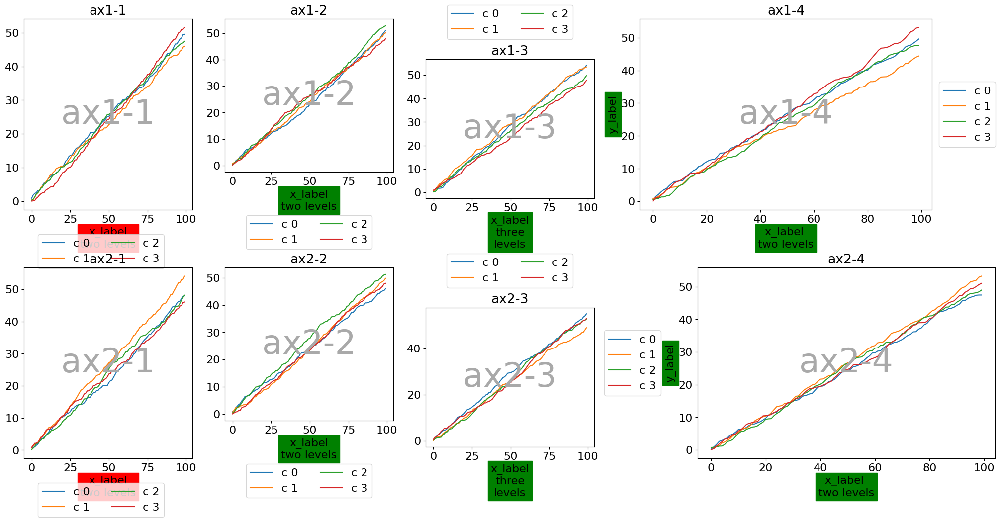

=========================
About Nested Grid Plotter
=========================

|License| |Stars| |Python| |PyPI| |Downloads| |Build Status| |Documentation Status| |Coverage| |Codacy| |Precommit: enabled| |Code style: Ruff| |Ruff| |ty| |DOI|

🚀 Quick start
===============

To install nested-grid-plotter functionality, see the :ref:`installation instructions<installation_ref>`.

For a deep overview of nested-grid-plotter functionality, see the :ref:`user guide<user_guide_ref>`.

You can also refer to the :ref:`API reference guide<api_reference_ref>` for an exhaustive
list of all what is possible with nested-grid-plotter.

🎯 Motivations
===============

NestedGridPlotter is based on `matplotlib <https://matplotlib.org/>`_ and intends to simplify the plotting of nestedgrid by providing a objected oriented class.

.. code-block:: python

    import nested_grid_plotter as ngp

    plotter = ngp.NestedGridPlotter(
        ngp.Figure(
            constrained_layout=True,  # Always use this to prevent overlappings
            figsize=(10, 5),
        ),
        builder=ngp.SubfigsBuilder(
            nrows=1,
            ncols=2,
            sub_builders={
                "the_left_sub_figure": ngp.SubplotsMosaicBuilder(
                    mosaic=[["lt1", "lt1"], ["lb1", "rb1"]],
                    gridspec_kw=dict(height_ratios=[2, 1], width_ratios=[2, 1]),
                    sharey=False,
                ),
                "the_right_sub_figure": ngp.SubplotsMosaicBuilder(
                    mosaic=[["l2", "rt2"], ["l2", "bt2"]],
                    gridspec_kw=dict(height_ratios=[2, 1], width_ratios=[2, 1]),
                    sharey=False,
                ),
            },
        ),
    )
    plotter.identify_axes()  # Helper to add the name of the axis on the plot
    plotter.fig

   Example of figure with nested figures and axes built using `nested_grid_plotter`.

It provide multiple utilities such as grid alignment:

   Example of grid ticks alignment made easy thanks to `nested_grid_plotter`.

As well as wrapper for complex plots and animations.

.. figure:: _static/animation_example.gif
   :alt: animation_example
   :width: 100%
   :align: center

   Example of complex animation built using `nested_grid_plotter`.

It also allows to make legend positioning and gathering flexible and simpler with some automatic placement solvers:

   Example of figure with semi-automatic legend placement to avoid overlappings with axis labels and plots.

**The complete and up to date documentation can be found here**: https://nested_grid_plotter.readthedocs.io.

In addition to simplifying the matplotlib workflow, our focus are:

- To provide understandable, modern code using the high-level language python, while using typing, explicit function names and standardized formatting thanks to `Ruff <https://docs.astral.sh/ruff/>`_ and `ty <https://docs.astral.sh/ty/>`_;
- To provide detailed and explicit documentation;
- To offer totally free code, including for commercial use, thanks to the **BSD 3-Clause License**;

🖋️ How to cite
==============

If you use this piece of software in your work, please cite it as:

.. code-block::

    Collet, A. (2026). NestedGridPlotter - A matplotlib wrapper for nested grids and some more.
    Zenodo. DOI: `10.5281/zenodo.8215056` https://doi.org/10.5281/zenodo.8215056

📧 Contact
==========

For questions, suggestions, or contributions, you can reach out via:

- Email: antoinecollet5@gmail.com
- GitHub: https://github.com/antoinecollet5/nested_grid_plotter

We welcome contributions!

🔑 License
===========

This project is released under the **BSD 3-Clause License**.

Copyright (c) 2026, Antoine COLLET. All rights reserved.

For more details, see the `LICENSE <https://github.com/antoinecollet5/nested_grid_plotter/blob/master/LICENSE>`_ file included in this repository.

⚠️ Disclaimer
==============

This software is provided "as is", without warranty of any kind, express or implied,
including but not limited to the warranties of merchantability, fitness for a particular purpose,
or non-infringement. In no event shall the authors or copyright holders be liable for
any claim, damages, or other liability, whether in an action of contract, tort,
or otherwise, arising from, out of, or in connection with the software or the use
or other dealings in the software.

By using this software, you agree to accept full responsibility for any consequences,
and you waive any claims against the authors or contributors.

.. |License| image:: https://img.shields.io/badge/License-BSD_3--Clause-blue.svg
    :target: https://github.com/antoinecollet5/nested_grid_plotter/blob/master/LICENSE

.. |Stars| image:: https://img.shields.io/github/stars/antoinecollet5/nested_grid_plotter.svg?style=social&label=Star&maxAge=2592000
    :target: https://github.com/antoinecollet5/nested_grid_plotter/stargazers
    :alt: Stars

.. |Python| image:: https://img.shields.io/pypi/pyversions/nested-grid-plotter.svg
    :target: https://pypi.org/pypi/nested-grid-plotter
    :alt: Python

.. |PyPI| image:: https://img.shields.io/pypi/v/nested-grid-plotter.svg
    :target: https://pypi.org/pypi/nested-grid-plotter
    :alt: PyPI

.. |Downloads| image:: https://static.pepy.tech/badge/nested-grid-plotter
    :target: https://pepy.tech/project/nested-grid-plotter
    :alt: Downoads

.. |Build Status| image:: https://github.com/antoinecollet5/nested_grid_plotter/actions/workflows/main.yml/badge.svg
    :target: https://github.com/antoinecollet5/nested_grid_plotter/actions/workflows/main.yml
    :alt: Build Status

.. |Documentation Status| image:: https://readthedocs.org/projects/nested-grid-plotter/badge/?version=latest
    :target: https://nested-grid-plotter.readthedocs.io/en/latest/?badge=latest
    :alt: Documentation Status

.. |Coverage| image:: https://codecov.io/gh/antoinecollet5/nested_grid_plotter/branch/master/graph/badge.svg?token=ISE874MMOF
    :target: https://codecov.io/gh/antoinecollet5/nested_grid_plotter
    :alt: Coverage

.. |Codacy| image:: https://app.codacy.com/project/badge/Grade/f4991359b8e84a44bbadf4f1a70bfa21
    :target: https://app.codacy.com/gh/antoinecollet5/nested_grid_plotter/dashboard?utm_source=gh&utm_medium=referral&utm_content=&utm_campaign=Badge_grade
    :alt: codacy

.. |Precommit: enabled| image:: https://img.shields.io/badge/pre--commit-enabled-brightgreen?logo=pre-commit
   :target: https://github.com/pre-commit/pre-commit

.. |Code style: Ruff| image:: https://img.shields.io/badge/code%20style-Ruff-000000.svg?style=flat
    :target: https://github.com/psf/black
    :alt: Black

.. |Ruff| image:: https://img.shields.io/endpoint?url=https://raw.githubusercontent.com/astral-sh/ruff/main/assets/badge/v2.json
    :target: https://github.com/astral-sh/ruff
    :alt: Ruff

.. |ty| image:: https://img.shields.io/endpoint?url=https://raw.githubusercontent.com/astral-sh/ty/main/assets/badge/v0.json
    :target: https://github.com/astral-sh/ty
    :alt: Checked with ty

.. |DOI| image:: https://zenodo.org/badge/DOI/10.5281/zenodo.8215056.svg
   :target: https://doi.org/10.5281/zenodo.8215056
